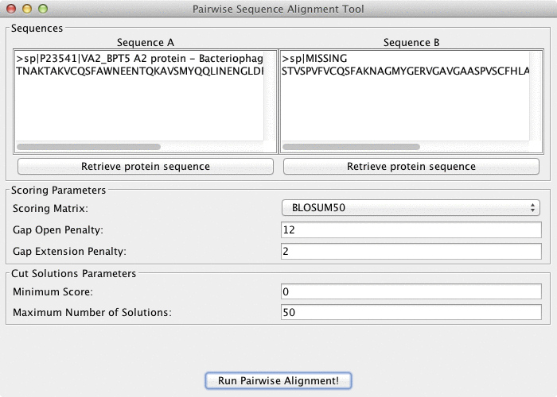

# Pairwise Sequence Aligner Application

This project consists of:
- An abstract framework to compute sequence alignments.
- An implementation of the pairwise alignment algorithms for local, global, repeated and overlap global, plugged into the framework.
- An end user Java Swing application using this framework to align sequences.

## Getting Started

### Web Service

To launch the web service issue the following command from the cloned project directory:

```
	./gradlew run
```


### Swing application



To launch the swing application issue the following command from the cloned project directory:

```
	./gradlew run
```

#### Usage

- Initially it gives you an interface where to input the parameters for the alignment to compute:

    1. `Sequence A` and `Sequence B` to be aligned. The application comes preset with a couple of example sequences in
these fields (for demo purposes).
    2. `Scoring matrix` to be used (`BLOSUM 50`, `BLOSUM 62` or `PAM 250`)
    3. Values for gap penalties.
    4. Cut solutions parameters.
    5. Type of alignment to be applied (`Local`, `Repeated Local`, `Global`, `Overlap Global`)

- Once you are ready to run the alignment just press the `Run Pairwise Alignment!` button. The application will switch to
the `results` view, presenting the following information:

    1. A graphical view (`Alignment Plot`) of the currently selected `alignment solution`.
    2. A drop down control to select which one of the `alignment solution`s computed to currently explore.
    3. Statistics about the currently selected `alignment solution` (score, positives, identities, length and sequences sizes).
    4. A textual representation of the currently selected `alignment solution`. The format is similar to FASTA.

